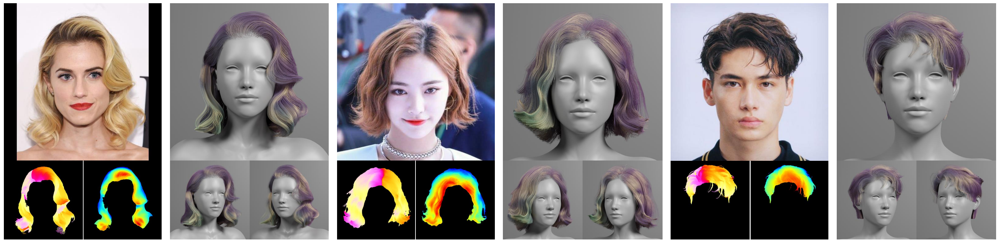

# HairStep: Transfer Synthetic to Real Using Strand and Depth Maps for Single-View 3D Hair Modeling (CVPR2023 Highlight) [<a href="https://paulyzheng.github.io/research/hairstep/" target="__blank">Projectpage</a>]

<p align="center"></p></br>

## Dataset
All data of HiSa & HiDa is hosted on Google Drive:

| Path | Files | Format | Description
| :--- | ----: | :----: | :----------
| [HiSa_HiDa](https://drive.google.com/open?id=16_wS405x3sTCbIo2rPXr9q6Y_kuS6tk-) | 12,503 | | Main folder
| &boxvr;&nbsp; [img](https://drive.google.com/open?id=1kXgdqZIfUwJ-dtwbqxiLgGOxDORrDoUa) | 1,250 | PNG | Hair-centric real images at 512&times;512
| &boxvr;&nbsp; [seg](https://drive.google.com/open?id=1EH0TGU443m-BDH_6_8rQfOaAR6iNTWau) | 1,250 | PNG | Hair masks
| &boxvr;&nbsp; [body_img](https://drive.google.com/open?id=1-2Fjos3OSTcxefalX6N56Yl61x1XSqRv) | 1,250 | PNG | Whole body masks
| &boxvr;&nbsp; [stroke](https://drive.google.com/open?id=1E56OPQZ2lpF2E5VovLOa_oDxHG2cglWd) | 1,250 | SVG | Hair strokes (vector curves) manually labeled by artists
| &boxvr;&nbsp; [strand_map](https://drive.google.com/open?id=1E6T8w8jsMHXBMEHohDMNUsvKd8D9JgTL) | 1,250 | PNG | Strand maps with body mask
| &boxvr;&nbsp; [camera_param](https://drive.google.com/open?id=16V4drMAO01tAehfKe827Y2xANpr-hDXd) | 1,250 | NPY | Estimated camera parameters for orthogonal projection
| &boxvr;&nbsp; [relative_depth](https://drive.google.com/open?id=1kTwVVGuRvgElHJDTCYQ6kpVsLbGdamRZ) | 2,500 |  | Folder for the annotation of the ordinal relative depth
| &nbsp;&nbsp;&nbsp;&nbsp;&boxvr;&nbsp; [pairs](https://drive.google.com/open?id=1EQoS11JavkaIB30tVbnD7blg1WdOaWYo) | 1,250 | NPY | Pixel pairs randomly selected from adjacent super-pixels
| &nbsp;&nbsp;&nbsp;&nbsp;&boxvr;&nbsp; [labels](https://drive.google.com/open?id=1DJp8bB6m34UTkz1YPnvH2NDqHx1z832c) | 1,250 | NPY | Ordinal depth labels for which pixels are closer in pixel pairs
| &boxvr;&nbsp; [dense_depth_pred](https://drive.google.com/open?id=16SmAFmH-XKSWTiDB8-1Y-jYQ6E_twsOU) | 2,500 |  | Folders for dense depth maps generated by our domain adaptive depth estimation method
| &nbsp;&nbsp;&nbsp;&nbsp;&boxvr;&nbsp; [depth_map](https://drive.google.com/open?id=1kaMguubZcvc4kpigijvD2KkMOY4seldr) | 1,250 | NPY | Nomalized depth maps (range from 0 to 1, the closer the bigger)
| &nbsp;&nbsp;&nbsp;&nbsp;&boxvr;&nbsp; [depth_vis](https://drive.google.com/open?id=1k_9rYcCRthnq5NmynqHYtmHdUJbJNAQG) | 1,250 | PNG | Visulization of depth maps
| &boxvr;&nbsp; [split_train.json](https://drive.google.com/open?id=1-9cZxp1KsJu9PUZpc4It6reihWxRrdV6) | 1 | JSON | Split file for training
| &boxur;&nbsp; [split_test.json](https://drive.google.com/open?id=1-EVSNXbfXhaiAxGSDq1tmaNz_pdqaFdm) | 1 | JSON | Split file for testing

**The HiSa & HiDa dataset and pre-trained checkpoints based on it are available for non-commercial research purposes only**. All real images are collected from the Internet. Please contact [Yujian Zheng](https://paulyzheng.github.io/about/) and [Xiaoguang Han](https://gaplab.cuhk.edu.cn/) for questions about the dataset.

## Installation
  ```
git clone --recursive https://github.com/GAP-LAB-CUHK-SZ/HairStep.git

cd HairStep

conda env create -f environment.yml
conda activate hairstep

pip install torch==1.9.0+cu111 torchvision==0.10.0+cu111 -f https://download.pytorch.org/whl/torch_stable.html

pip install -r requirements.txt

cd external/3DDFA_V2
sh ./build.sh
cd ../../
  ```
Code is tested on torch1.9.0, CUDA11.1, Ubuntu 20.04 LTS.

## Single-view 3D Hair Reconstruction
Put collected and cropped potrait images into ./results/real_imgs/img/. 

Download the checkpoint of [SAM](https://dl.fbaipublicfiles.com/segment_anything/sam_vit_h_4b8939.pth) and put it to ./checkpoints/SAM-models/. 

Download checkpoints of [3D networks](https://drive.google.com/file/d/1-akuukaYYtJDta24AAqVdgUOGte4EmQf/view?usp=drive_link) and put them to ./checkpoints/recon3D/.
  ```
  CUDA_VISIBLE_DEVICES=0 python -m scripts.img2hairstep
  CUDA_VISIBLE_DEVICES=0 python scripts/get_lmk.py
  CUDA_VISIBLE_DEVICES=0 python -m scripts.opt_cam
  CUDA_VISIBLE_DEVICES=0 python -m scripts.recon3D
  ```
Results will be saved in ./results/real_imgs/.

## TODO
- [x] Share the HiSa & HiDa datasets
- [x] Release the code for converting images to HairStep
- [x] Release the code for reconstructing 3D strands from HairStep
- [ ] Release the code for computing metrics HairSale & HairRida 
- [ ] Release the code for training and data pre-processing

(within a few days before the end of Feb., sorry for the delay)

**Note**: A more compact and efficient sub-module for 3D hair reconstruction has been released, which has comparable performance to NeuralHDHair* reported in the paper.

The original hair matting approach is provided by Kuaishou Technology, which cannot be released. The substitute method based on SAM fails sometimes.

## Citation
Please cite our paper as below if you find this repository is helpful:
```
@inproceedings{zheng2023hairstep,
  title={Hairstep: Transfer synthetic to real using strand and depth maps for single-view 3d hair modeling},
  author={Zheng, Yujian and Jin, Zirong and Li, Moran and Huang, Haibin and Ma, Chongyang and Cui, Shuguang and Han, Xiaoguang},
  booktitle={Proceedings of the IEEE/CVF Conference on Computer Vision and Pattern Recognition},
  pages={12726--12735},
  year={2023}
}
```

## Acknowledgements
This repository is based on some excellent works, such as [HairNet](https://github.com/papagina/HairNet_DataSetGeneration), [PIFu](https://github.com/shunsukesaito/PIFu), [3DDFA_V2](https://github.com/cleardusk/3DDFA_V2), [SAM](https://github.com/facebookresearch/segment-anything) and [Depth-in-the-wild](https://github.com/yifjiang/relative-depth-using-pytorch). Many thanks.
